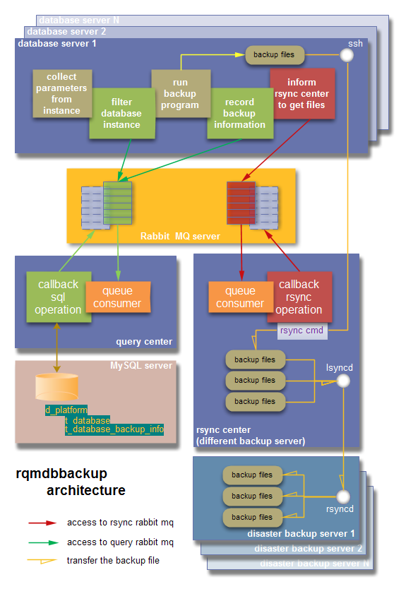

rqmdbbackup
===========

rqmdbbackup 是一个数据库备份工具，主要完成本机多引擎数据库备份、灾备传输、备份信息记录和过期备份删除等功能。

备份程序通过命令参数控制运行不同功能。程序日志默认保存在程序目录下的日志文件中，如需要使用屏显日志需要指定 –debug 参数。
命令行参数利用名为argparse的python模块，实现命令行分组。每一个模块对应一个组名：
1)	backup 实现本地备份程序
必选参数 –store_path 指定备份保存路径
可选参数 –engine= [{mysql,mongodb,oracle}]   --port [PORT] ，可以对特定数据库引擎对应的端口实例进行单独备份
2)	rsync_center 启动异地备份拉取程序
必选参数 –store_path 指定备份保存路径
3)	query_center 启动数据库操作程序
无参数
另外，需注意程序运行使用的连接账号都硬写在程序代码中，如更换地址，需要改写程序重新部署。

备份程序只有一个执行文件，命名为rqmdbbackup.py，规范存放在/opt/sys/bin/目录下。
Python程序依赖模块：
python27.x86_64（python2.7.6）
python27-netifaces.x86_64（用于发现机器网卡信息）
python27-pika.noarch（用于Rabbit MQ操作，可使用Kombu模块替代）
python27-psutil.x86_64（用于进程抓取和操作）
MySQL-python.x86_64、mysql-libs.x86_64（用于数据库操作，只有信息处理模块query_center才用到）
	运行日志存放在程序存放目录，文件以各个模块命令参数区分，分别是：backup.log query_center.log rsyncd_center.log
